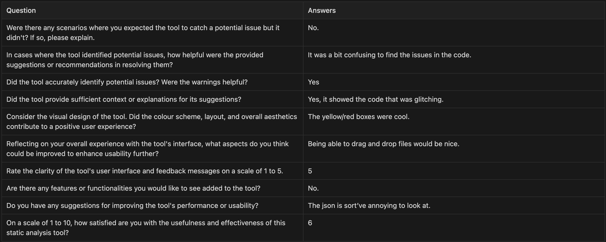
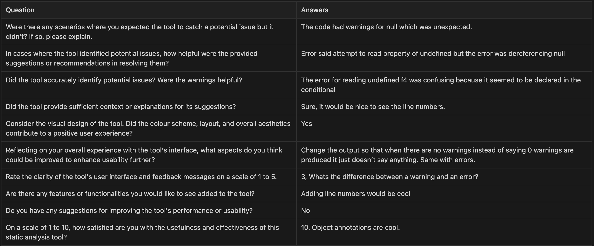

### Checkin 1
* #### The team has discussed the following ideas:
  1. Unhandled Promises - This idea would satisfy the static check and targetting a real-world programming language requirement. This would be done in JavaScript or TypeScript.
  2. Array out of Bounds - This idea has potential to satisfy all 3 of the criterias lsited in the slide decks. This project could be done in any programming language. Our team is most familiar with Java, JavaScript, and Python.
  3. Segfaults - This idea satisfies the real-world programming requirement and would also need to satisfy the visual component requirement. This project would likely be done in C or C++.
* #### TA Meeting Discussion
  * We discussed with our TA the segfault idea in C++. TA said the idea might be very challenging and hard to implement.
  * We also discussed an idea with testing whether the DOM for a website is properly tested. TAs initial thoughts are that the idea seems similar to code coverage and if it is, we would need to do more to make it more interesting.
  * We discussed scope with the TA. We weren't sure how big/broad our program analysis tool needed to be. After discussing with the TA, we came up with the unhandled promise and array out of bounds idea above. 
* #### Follow-up Tasks
  * We will be coming up with more project ideas that meet 2 of the 3 requirements listed in the slide deck
  * We will also do more research into the ideas listed above and confirm with TA or profs if the idea is feasible. 

### Checkin 2
  * We plan on doing a program analysis tool that checks that the fields of an object exist when that field is access and used. 
  * We plan to think of more examples and add more complex features for the checker.
  * We have identified the following modules that could potentially be split up:
    * The static checker for if/else blocks. (When certain if/else blocks are hit and fields are/aren't declared, proper error messages are shown)
    * The static checker for loops. (When certain blocks of the loop are hit and fields are/aren't declared, proper error messages are shown)
    * The static checker for function calls. (When objects are passed via reference to functions and fields are/aren't declared, proper error messages are shown)
  * So far we are still fleshing out examples to ensure that our project idea is complex enough. We have identified potential points to split up work, but the way it's split up is subject to change as we flesh out our project idea. 
* Roadmap for what should be done when, including specific goals for completion by future Milestones (propose at least three such goals per future Milestone, along with who will work on them; you can revise these later as needed).

#### TA Meeting Discussion
* The TA wanted us to consider more complex features for the unhandled promise static checker.
* We discussed complexity of the static checker, specifically with array out of bounds errors and the level of complexity our static checker needed to achieve in general.
* The TA wanted us to consider more examples and to verify that the examples actually through runtime errors in JavaScript. For example, we had an example `delete obj.f1` followed by a check `obj.f1 === "hello"`. In this example we considered this to be an error, but the TA reminded us that in JavaScript this statement would be comparing null to the string "hello" and is a valid program.

#### Timeline
* March 07 -------------------Check-In 2------------------
* March 07 - Plan what the static analysis checks for and verify that it's complex enough and meets the project requirements
* March 10 - Create test examples of errors that occur and think of the error message that the static checker shows for each error.
* March 11 - Implement the static checker for the tests and create unit tests.
* March 13 - Complete user study. Identify what the user thought was good and bad about the static checker.
* March 14 -------------------Check-In 3------------------
* March 18 - Implement improvements based on results of the user study and create unit tests for updated implementation
* March 20 - Fix bugs for the given test examples
* March 21 -------------------Check-In 4------------------
* March 21 - Complete final user study
* March 26 - Implement improvements based on results of the user study and update/create unit tests.
* March 28 - Fix Bugs
* March 28 -------------------Check-In 5------------------
* March 31 - Add final improvements to the static checker
* April 02 - Complete plans for the video presentation
* April 05 - Finish static checker details, ensure all unit tests are passing.
* April 07 - Finish the video presentation and submit.
* 
### Checkin 3
* Our project is mostly a static checker. We want to verify that when an objects field is dereferenced that the field is not null. Examples of the errors that the static checker can handle can be found in the readme.
* We have only created a proof of concept, and thus haven't done a user study yet. 
* We are behind on the timeline. However, we have a proof of concept and after the meeting we also have a better idea of what we want to implement and can now start making progress.

#### TA Meeting Discussion
* Ultimate goal is to detect dereferencing null properties
* We demoed a proof of concept, and ta mentioned this was a good first step and wanted us to think about more.
* Wants us to add more examples so that we consider `if/else` and `for/while/do while` `functions/closures` and how we handle checks under these constructs.
* All the analysis is done on the AST, but when we may want to transform our AST so that it represents the control flow that’ll make our analysis easier. (by pruning out unrelated information). 
* We discussed adding some nicer error reporting so that it’s not just json.
* We discussed thinking about what error to report and how you want to report it. For example, “There is a potential error here”.

### Checkin 4
##### Implementation Status
* The visitor that visits the AST nodes has been implemented
* More unit tests have been created
* More examples for errors that are handled in loops and functions have been created.

##### Final User Study Plan
* Clarified approach to the user study with TA. 
* We will create an example program, have the user run the program, and have them attempt to fix the problem identified by the static checker.
* After, we will ask them questions regarding how helpful the static checker was in fixing the program.

### Planned Timeline
* We are behind on the user study because we haven't finished the initial implementation of the static checker.
* Other than the user study, we are still following the timeline that was described in checkin-2.

#### TA Meeting Discussion
* We clarified how to conduct the user study. We weren't sure whether we should have a premade program or have the user write a program from scratch, but the TA clarified that the premade program was a reasonable approach.

### Checkin 5
#### Status of user study (should be completed this week at the latest)
* The final user study is planned to be done by April 1st.

#### Are there any last changes to your design, implementation or tests?
* We have added object annotations above functions as comments, so that the static analysis will know the fields that exist on an object when it is passed into a function.

#### Plans for final video (possible draft version).
* We will all participate in filming the video responsible for the video. We plan to film the video presentation over the break and
  will split it so that everyone will present the aspect of the analysis they worked on. (Henry will present abstract state class and the object annotation feature,
  Phillips will present the error messages and the results of the user studies, Junkai will present the preprocessing steps, and Justin and TianYang will
  present the static analysis behavior in conditional/loops).

#### Planned timeline for the remaining days.
* We plan to write more tests and finalize the addition of the object annotation feature. We also plan to film a draft video by Tuesday to see what parts needs to be shortened/elaborated/removed/added.

#### TA Discussion Changes and Feedback
* We talked to the TA about the preprocessing step. In particular, we asked about how we would implement removing an if/else block if the condition always evaluated to false. TA mentioned a graduate level course taught by Alex that discusses SAT; however, this seemed to be too complicated for what we hoped to accomplish for our implementation.
* TA also proposed us to have an almost final version of the project given that since next weeks meeting is the last meeting.

## User Study Results
    
#### Initial User Study

The tool accurately identifies potential issues and provides helpful warnings. User had troubling finding the code that was identified with the issues. They liked the yellow/red output for warnings/errors. They would've liked to been able to drag and drop a file rather than copy and paste the code. They did not like looking at the json output. For next steps, we plan to make it easier for users to find the problematic code. We don't plan to prioritize enabling drag and dropping files into the ui, but will if we have time. We will also update the output so that it's not json.

#### Final User Study

The user was surprised by the null output. They were confused because the code reported that a variable might be undefined, but the code was dereferencing a non-existent attribute. They would've also liked to see line numbers. They did not like that the grammar was wrong when there was 1 error vs 2 errors (the 's). They also liked the object annotations.
