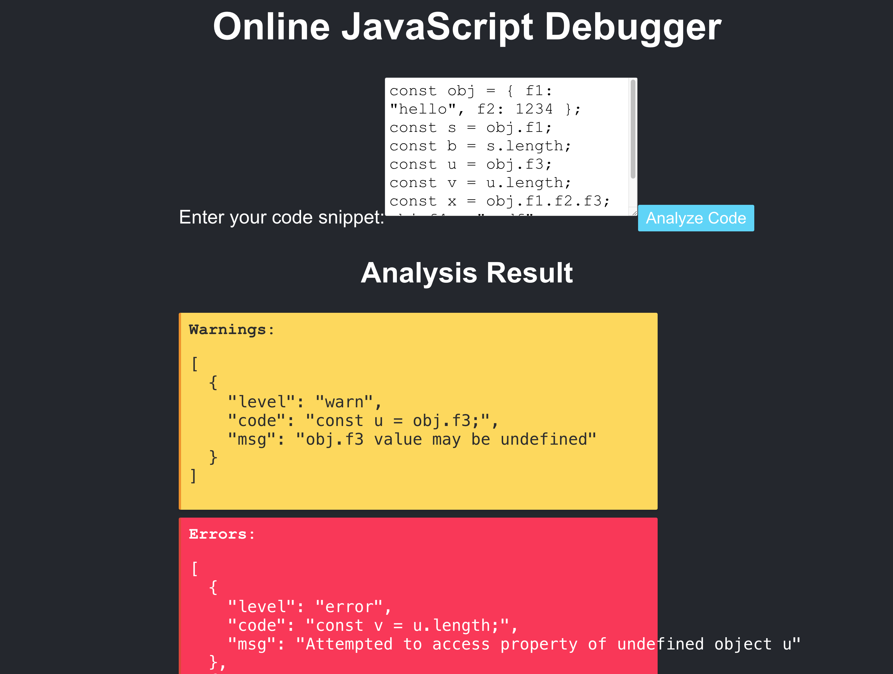
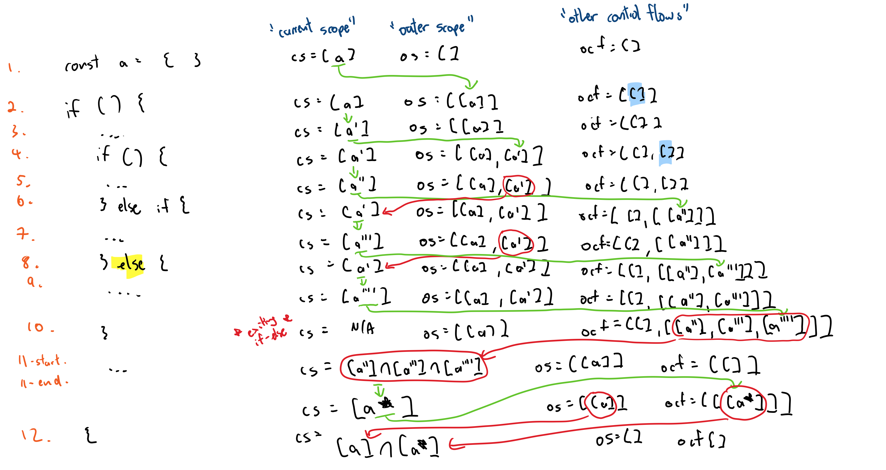

# SmartObjectsJS - A Smart JavaScript Object Checker

A project from group 1. 

Link for video on project process and short demo : https://drive.google.com/file/d/1qZvXefcDWG9__EZQIvyacwNIa6KUTA-q/view?usp=sharing

Table of Contents

<!-- vscode-markdown-toc -->
- [SmartObjectsJS - A Smart JavaScript Object Checker](#smartobjectsjs---a-smart-javascript-object-checker)
  - [1.0 Introduction](#10-introduction)
    - [1.1 Motivation](#11-motivation)
    - [1.2 Analysis Type](#12-analysis-type)
  - [2.0 Quick Start](#20-quick-start)
    - [2.1 Frontend User Interface](#21-frontend-user-interface)
  - [3.0 Basic Usage](#30-basic-usage)
  - [4.0 SmartObjectJS Limitations](#40-smartobjectjs-limitations)
    - [4.1 Member Expression Syntax](#41-member-expression-syntax)
    - [4.2 Preprocessor Limitations](#42-preprocessor-limitations)
  - [5.0 The Abstract State: Memory Class](#50-the-abstract-state-memory-class)
    - [5.1 Is The Memory Class Abstract Enough?](#51-is-the-memory-class-abstract-enough)
  - [6.0 Control Flow: If-Else Branches](#60-control-flow-if-else-branches)
    - [6.1 Analyzer Algorithm](#61-analyzer-algorithm)
  - [7.0 Control Flow: Loops](#70-control-flow-loops)
    - [7.1 Nested Loops](#71-nested-loops)
  - [8.0 Object Annotations](#80-object-annotations)
    - [8.1 Object Annotations For Variables](#81-object-annotations-for-variables)
    - [8.2 Object Annotations For Functions](#82-object-annotations-for-functions)
    - [8.3 Global Variables Inside Function Scope](#83-global-variables-inside-function-scope)
  - [9.0 User Studies](#90-user-studies)
  - [10.0 Examples](#100-examples)

<!-- vscode-markdown-toc-config
	numbering=false
	autoSave=true
	/vscode-markdown-toc-config -->
<!-- /vscode-markdown-toc -->

## <a name='Introduction'></a>1.0 Introduction

JavaScript is a very dynamically typed language and [JS objects]([https://developer.mozilla.org/en-US/docs/Web/JavaScript/Guide/Working_with_objects) are no exception. They are essentially a container of property/value pairs and its structure may be manipulated through various ways. These object manipulations are not tracked by JavaScript checker and can possibly lead to buggy code as the program may try to access properties of objects that do not exist.

SmartObjectsJS is a static analyzer that tracks object structures throughout the code, noting any manipulate on those structure. During object accesses, it warns the users when they access a non-existent property of an object and throws an error when trying to use the non-existent property in code.

### <a name='Motivation'></a>1.1 Motivation

Everyone in the group has experience with frontend development, and unfortunately, has used JavaScript extensively for their projects, as well as internships. This issue of "accidentally" accessing and using parts of objects which don't exist is not new to us and has caused a lot of headaches. Thus, we thought it would be a good idea to pursue a project along this theme.

### <a name='AnalysisType'></a>1.2 Analysis Type

The goal of SmartObjectsJS is to be able to be able to track object updates and accesses. And from our design discussions, this project seemed to set itself up to be a static analysis project.

Additionally, it seemed to simple to make this a dynamic analysis. Obviously, if we run the code, we will know if the code made a bad object access, since there will be some sort of runtime error. It becomes almost trival to simply report that error and call it a day.

## <a name='QuickStart'></a>2.0 Quick Start

***It is highly recommend to read the rest of the documentation before playing around SmartObjectJS.***

Blah, blah, blah. Documentation is boring, so we've made it really straightforward to test out SmartObjectJS yourself.

In the folder `test/examples`, we have included a number of JavaScript files containing various scenarios to demonstrate how SmartObjectJS works. Feel free to adjust these or make your own.

Steps to get started:

1. Clone this repository and run `npm install` in the root directory to install all dependencies.
2. Within the `package.json` in the scripts block for `build`, the second parameter for the `node` command points to the file to run SmartObjectJS on. Change that path to point to any `.js` file you wish to test.
   - Note that the `.js` file must be syntactically valid, or else SmartObjectsJS will not run.
   - By default, this points to `test/test_input.js`. Feel free to use this file as a sandbox environment to play around with the code.
3. Run `npm run build` to see SmartObjectJS in action!

### <a name='FrontendUserInterface'></a>2.1 Frontend User Interface

We have developed a simple frontend website that may be used as well. Overall formatting might be a little off, but it works!



Starting the API:

Before interacting with the React app, ensure the API is up and running:

    1.Navigate to the src/main directory.
    2.Execute node app.js to start the API server on localhost:3000.

Launching the React Application

With the API running, you can start the React front end.

Open a new terminal and go to the frontend directory within the project. Run `npm install` to install all frontend dependencies. Start the React app on a different port if the default one is in use. For example, to use port 3001...

On UNIX-based systems (Linux/macOS), run:

    PORT=3001 npm start

On Windows Command Prompt, run:

    set PORT=3001 && npm start

On Windows PowerShell, run:

    $env:PORT = 3001; npm start

The React application should open automatically in your default browser at http://localhost:3001. If not, manually navigate to that URL.

Updating the API Endpoint

If for any reason the API server is not running on port 3000, you'll need to update the React app's endpoint:

In the frontend/src/CodeAnalysis.js file, locate the fetch call within the handleSubmit function.
Change the endpoint to match your API server's address and port.
Save the changes and restart the React app for the changes to take effect.

## <a name='BasicUsage'></a>3.0 Basic Usage

To start off consider the following lines of code. We define an object, `obj`, and try to access various fields of it. The corresponding test file can be found in `test/examples/1-basic.js`

```javascript
 1| const obj = { f1: "hello", f2: 1234 };
 2| 
 3| const s = obj.f1;
 4| const b = s.length;
 5| 
 6| const u = obj.f3;
 7| const v = u.length;
 8| 
 9| const x = obj.f1.f2.f3;
10|
11| obj.f4 = "asdf";
12| const a = obj.f4;
```

A summary of the analysis is listed below. Note that the actual analysis output will not be this detailed; extra information is added here for the purpose of this explanation.

- Line 1: SmartObjectJS keeps track of the defined object `obj` and the structure of the object.
- Line 3: Constant `s` is assigned whatever `obj.f1` is. `f1` is defined on `obj`, thus it is ok and no warnings/errors reported.
- Line 4: `s` is a literal (it is a string). SmartObjectJS does care about accesses on literals. No warnings/errors reported.
  - The code may try to access a property of a literal that does not exist (i.e. `s.asdfasdf`). This will result in an error during runtime, but checking this is beyond the scope of SmartObjectJS.
- Line 6: Constant `u` is assigned whatever `obj.f3` is. `f3` is not defined on `obj` making `u` equal to undefined. JavaScript allows variables to be set to `undefined`, so no error is thrown. However, purposely setting a constant to `undefined` is unusual, so we throw a warning for this line.
- Line 7: Since `u` technically references a property of an object (`obj.f3`) and we know that `u` is undefined, the analyzer will throw an error because property access on an undefined is not allowed.
- Line 9: Constant `x` is assigned whatever `obj.f1.f2.f3` is. It is undefined so we throw a warning (same reasoning as line 6).
- Line 11: A new property is created on `obj` as `f4`. We update this in our backend memory.
- Line 12: Constant `a` is assigned whatever `obj.f4` is. Since in line 11 this property was set, `a` is defined and no warnings/errors reported.

> [!TIP] Aside
> In lecture, we talked about value-sensitive static analysis. SmartObjectJS falls under this category; we care about how the object changes throughout the program so we track its state. However, JS terminology defines objects as having property/value pairs and SmartObjectJS actually only cares about the property of the object, not the value associated with the property. So technically, this analysis would be a property-sensitive static analysis...

## <a name='SmartObjectJSLimitations'></a>4.0 SmartObjectJS Limitations

This section details limitations of SmartObjectJS and the reasons for them.

### <a name='MemberExpressionSyntax'></a>4.1 Member Expression Syntax

In JavaScript, there are two ways to access/set the property of an object.

- The "dot" notation.

```javascript
const obj = { f1: "hello", f2: 1234 };
const a = obj.f1;
obj.f1 = "SmartObjectJS";
```

- The "bracket" notation.

```javascript
// Access Pattern 1
const obj = { f1: "hello", f2: 1234 };
const a = obj["f1"];
obj["f1"] = "SmartObjectJS";

// Access Pattern 2
const obj2 = { f1: "hello", f2: 1234 };
const prop = "f1";
const a = obj[prop];
obj[prop] = "SmartObjectJS";
```

**SmartObjectJS only provides support for the "dot" notation and access pattern 1 of the "bracket" notation.** The main reason for this is to reduce the scope of the project. The two supported member access methods are straight-forward to implement. The second access pattern of the "bracket" notation necessitates that we track all literal variables as well (in our internal abstract state); this increases a lot of extra overhead that we don't have time to add.
<!-- 
### <a name='MemberAccessviaChaining'></a>4.2 Member Access via Chaining

JavaScript objects may be nested and it is perfectly viable (and supported by SmartObjectJS) to "chain" the properties to get a specific value. In other words, SmartObjectJS will check the following accesses and deem them to be warning/error free.

```javascript
const obj = {
    course: "CPSC 410",
    projects: {
        project1: {
            name: "SmartFiles",
            language: "Java"
        },
        project2: {
            name: "SmartObjectsJS",
            language: "JavaScript"
        }
    }
}

// Getting the name of the first project
const p1_name = obj.projects.project1.name;

// Getting the name of the second project
const p2_name = obj.projects.project2.name;
```

A possible action that is supported by JavaScript is to access properties on the literal itself in the same line. **This action is not supported by SmartObjectJS and should not be done.**

```javascript
// Getting the length of the name of the first project
const p1_name_length = obj.projects.project1.name.length;
```

This is because in the abstract state we store in the backend, we recognize that `obj` is an object and we follow the stated path to see if the property exists on that object (`projects.project1.name.length`). The final path "step" is `length`, which is not a property of `obj`, but a property of `String`, which is the type of the value at `obj.projects.project1.name`. There is too much overhead to check this, since this would mean we need to check both properties and values of an object.

Unfortunately, this also means that the above line would cause SmartObjectsJS to throw a warning, even though there isn't an error. To work around this, splint into two lines of code.

```javascript
// Getting the length of the name of the first project
const p1_name = obj.projects.project1.name;
const p1_name_length = p1_name.length;
``` -->

### <a name='PreprocessorLimitations'></a>4.2 Preprocessor Limitations

SmartObjectsJS only cares about objects, specifically user-defined objects. The analyzer comes with a preprocessor to filter out code that does not matter. It is important to note that this preprocessor is not perfect; there may be edge cases where the preprocessor removes too many lines of code or fails to remove other lines of code. Since the main goal of the project was to build an analyzer that tracks objects, we ultimately did not have the extra time to fine tune the preprocessor.

By default, the preprocessor is disabled. To enable the preprocessor, uncomment this line in the code, [link to line in code](https://github.students.cs.ubc.ca/CPSC410-2023W-T2/Group1Project2/blob/main/src/main/interpreter.js#L11).

Consider the following lines of code that is fed into SmartObjectsJs. Notice that there are a lot of constants being declared that are is not object related.

```javascript
const i = 1;
const j = "asdf";
const zz = j.length;

const obj = { f1: "hello", f2: 1234 };
const s = obj.f1;
const ll = s.length;

const abc = obj.f3;
const x = abc.vv;

const p = 4;
if (p === 4) {
    const aaa = "hello";
}

if (Math.random() > 0.5) {
    const b = "asdf";
    if (Math.random() > 0.5) {
        obj.f1 = "qwerty";
        const z = ";;;;";
    }
}

let ff;
while (Math.random() > 0.5) {
    ff = Math.random();
}
```

After preprocessing, the actual code fed into the analyzer would look like:

```javascript
const obj = { f1: "hello", f2: 1234 };
const s = obj.f1;
const ll = s.length;

const abc = obj.f3;
const x = abc.vv;

if (Math.random() > 0.5) {
    if (Math.random() > 0.5) {
        obj.f1 = "qwerty";
    }
}
```

When testing on your own, feel free to include other random code snippets, but just note that the preprocessor might not be perfect.

## <a name='TheAbstractState:MemoryClass'></a>5.0 The Abstract State: Memory Class

To track an object structure a memory class is used. Consider the following JavaScript code.

```javascript
const data = {
    name: "James Bond",
    id: "007",
    mission:
        {
            name: "spectre",
            status: "failed",
            location:
            { country: "Spain", city: "Madrid" }
        }
};
const mission = data.mission;
const agent = data.name;
```

The memory class has two maps for indirection (and to make aliasing and referencing easy). One map represents the symbol table and another map represents the actual memory. Additionally, there is also a map which stores literals that are declared from an object (like `agent` in the above example).

The memory class state after the execution of the lines of code is shown below.

```javascript
// Symbol table
{
    data: 0,
    "<data.mission>": 1,
    "<data.mission.location>": 2,
    mission: 1
}

// Memory table
{
    0: {
        name: "James Bond",
        id: "007",
        mission: "<data.mission>"
    },
    1: {
        name: "spectre",
        status: "failed",
        location: "<data.mission.location>"
    },
    2: {
        country: "Spain", 
        city: "Madrid"
    }
}

// Literal map
{
    agent: "James Bond"
}
```

Note that in order to support nested objects, the objects are flattened prior to storage. As an example, the `data.mission` property points to another object. Rather than storing the entire data object as one "thing" in memory, the nested object is pulled out, and the field will point to an object called `<data.mission>`.

> [!NOTE]
> The format for an internal object will always follow the same structure: the path to the nested object joined by `.`, enclosed by `<>` tags. This means that the raw object should not have any properties that match this pattern, or else it will mess up the memory tracking.

The flattening necessary step because JavaScript uses pass by reference for objects. In the very next line, the `mission` constant references the `data.mission` property. Thus, any changes to the actual object should affect both the `data` and `mission` constant. In the symbol table, `mission` is aliased to `<data.mission>` to ensure changes are synced properly.

The literal map simply tracks constants that are defined from literal values within an object. In a sense, these literal exist because of a property of an object, so we track it as part of the analysis. The values are not important, but the keys to the maps are.

```javascript
const agent = data.name;

/**
 * The literal map now contains `agent`. However, if we did not track `agent`, we would not
 * be able to give any feedback on the following line. And we should give feed back because 
 * agent was originally `data.name`.
 */
const l = agent.length;
```

### <a name='IsTheMemoryClassAbstractEnough'></a>5.1 Is The Memory Class Abstract Enough?

>*If SmartObjectsJS only cares about the properties of an object, why is the memory class still tracking the values for each property? Why not make the memory class more abstract and only keep the properties?*

This is a valid question that has been asked many times. This is because it was the most straight-forward to implement like this. If we tried to be more abstract, we would discard the literal values of properties, but at the same time, need to keep the values of properties that are objects. This leads to a more complex data structure design that just isn't worth it.

Additionally, keeping the values might actually be beneficial for future work. One of the limitations described above is [member chaining](./README.md###Member-Access-via-Chaining). It is possible to add additional functionality to check for property access on literal values, since memory tracks the value.

## <a name='ControlFlow:If-ElseBranches'></a>6.0 Control Flow: If-Else Branches

SmartObjectsJS will analyze each path from if-else branches and at the conclusion of the if-else branch, it will keep track of all possible memory states. Member access errors will only be given out if all possible states do not have requested property. If more than one state, but not all memory states have a property, a warning is shown (signalling a potentially undefined access).

Consider the following code example. Note the comments which show which lines warnings/errors would be reported. 

```javascript
 1| const asdf = { f1: "hello", f2: 1234 };
 2| 
 3| if (Math.random() > 0.5) {
 4|     asdf.f3 = "adsfasdf";
 5|     if (Math.random() > 0.5) {
 6|         const zz = asdf.f3;
 7|         const ll = asdf.cc; // warning reported
 8|     }
 9| } else {
10|     const tt = asdf.f3.asdf; // error reported
11|     if (Math.random() > 0.5) {
12|         const gg = asdf.f3.dd; // error reported
13|     }
14| }
15| 
16| const xx = asdf.f3; // warning reported, only 2 of the branches defines the property

```

There are 4 possible paths through the main if-else block. Thus, at the end of the block (line 14), there will be 4 "main" memory states that is being tracked. At line 16, when `asdf.f3` is checked, SmartObjectsJS will check all 4 memory states and note that only 2 of the 4 have `asdf.f3` and a warning will be reported.

Note that the logical test within the if condition is not considered; SmartObjectsJS will analyze all possible paths regardless of whether it is possible to actually reach them. In this regard, this static analysis will greatly over-approximate the possible memory states. But this is just the trade-of of doing a static analysis.

A simplistic approach of keeping all possible memory states in an array as the analyzer goes through the if-statement can be imprecise and very difficult to handle.As a quick example (looking at the code block above), at line 8, there would be three possible memory states:

- State 1: The state at line 2 (not going into the if block)
- State 2: The state at line 4 (only going into the first if block)
- State 3: The state at line 8 (going into both if blocks)

If there was more code between lines 8 and 9, then changes to the memory states will affect only states 2 and 3. For changes that happen else block, they will affect state 1 only. And if there are more further nested if-statements, things can get unwieldy very quickly.

### <a name='AnalyzerAlgorithm'></a>6.1 Analyzer Algorithm

Instead, SmartObjectsJS will use an algorithm to allow it to easily track and change only the memory states in its current scope. It will use the following 3 data structures:

- `currentScope`: Array of memory states within in the current scope, `memory[]`.
  - When going into an if statement, this is considered to be "going into a new scope". This can be thought of as a divergent path.
  - At line 7, everything within the current scope would be the memory states between the curly braces, `{}`, of line 5 to 8.
- `outerScope` An array of array of memory states for each outer scope, `memory[][]`.
  - In the example above, an outer scope would be the outer if statement(s) of a nested if statement. The global scope is the outermost scope; this is the base program.
  - This parameter essentially tracks the depth (how deep) the current path is (or how nested the current path is).
- `otherControlFlow`: An array of an array of an array of memory states for each different control flow path, `memory[][][]`.
  - An else block is in a different scope, but it is not an inner or outer scope of the if statement. It is a different path that is independent of all the memory state changes that happened in the above if-block. Thus, every time we go into a new else-if or else block, we need to store the previous memory states.

The dimension of the arrays does not have anything to do with the depth! In other words, we can support an arbitrarily deep if statement. The following image is a hand drawn sketch of the algorithm in action. An explanation below it.



- Line 1: An object `a` is declared with some structure (that is not important for this example). As a shorthand, this will represent the memory state `a`.
- Line 2: The code enters into an if statement. This means that goes into a new scope. At this line, the current scope is unchanged, but copy of the current scope is made and pushed into the outer scope. An empty array is pushed into the other control flows array.
- Line 3: This is the body of the if statement. It will do some stuff to change the current memory state into `a'`.
- Line 4: Another if statement is encountered and a new scope is entered. The current memory state is unchanged and a copy of the current memory state is pushed to the end of the outer scope array. Another empty array is pushed into the other control flows array.
- Line 5: This is the body of the if statement. It will do some stuff to change the current memory state into `a''`.
- Line 6: An else-if statement is encountered. It changes to a new control flow. `a''`, which is the memory state as a result of line 5, is pushed into the last array of the other control flow array (green line). The last memory state array of the outer scope is copied and set as the current scope (red line); this the same state at the end of line 3.
- Line 7: This is the body of the if statement. It will do some stuff to change the current memory state into `a'''`.
- Line 8: An else statement is encountered. It changes to a new control flow. `a'''`, which is the memory state as a result of line 7, is pushed into the last array of the other control flow array (green line). The last memory state array of the outer scope is copied and set as the current scope (red line); this the same state at the end of line 3.
- Line 9: This is the body of the else statement. It will do some stuff to change the current memory state into `a''''`.
- Line 10: Exiting the entire if-else statement. `a''''`, which is the memory state as a result of line 9, is pushed into the last array of the other control flow array (green line). The current scope in the code is probably `a''''`, but it does not matter for this algorithm.
- Line 11-start: Immediately after the if-else block, all the memory states in the other control flows array is unioned together. This represents all possible memory states that can be obtained from traversing every single path in the if-else block.
- Line 11-end: There the code changes the memory states into `a*`, we reach the end of the outer if-block. We push `a*` into the last array of other control flows array.
- Line 12: End of the outer if-block and going back into the outer scope. The current scope if the union of the outer scope and the other control flow (the two red lines). 
  - The outer scope is unioned because the outer if block does not have an else statement. One valid path is simply not going into the if statement at all, and that is represented by the memory state stored in the outer scope.

> [!NOTE]
> The memory states are never merged. This means that the number of memory states grows very quickly, especially if there is a lot of branching. This is just a behaviour of the analyzer that we do not have the time to further optimize. Check out `test/examples/99-your-computer-will-die.js` if you think you have a NASA level computer.

## <a name='ControlFlow:Loops'></a>7.0 Control Flow: Loops

Handling loops is even tricker than handling if statements. The main crux of the issue is that loops potentially will run code its block multiple times, changing the state of memory depending on the iteration.

```javascript
const asdf = { f1: "hello", f2: 12345 };
for (let i = 0; i < 10; i++) {
    const ll = asdf.f3.length;          // ?? Error or no error ??
    if (i > 1) {
        asdf.f3 = { mission: "impossible" };
    }
}
```

Depending on the loop iteration, `asdf.f3.length` may or may not be valid. With how SmartObjectsJS is currently setup, there is no ideal solution to handle this.

Instead, SmartObjectsJS makes a major simplification: if the program enters a loop, it will iterate until completion. In this `for` loop example, it is assumed that it will iterate 10 times. For `while` loops, it is assumed that they are well formed and will exit the loop eventually. The object check only happens at the end of the loop.

In other words, there may be an error that is encountered at a certain iteration of the loop (i.e. on first iteration of the loop there is an error); SmartObjectsJS cannot definitively know that.

> [!NOTE]
> `break` statements inside the loop is also another complication. The analyzer does not do anything when a `break` is encountered. This may lead to more inaccuracies. The use of `break` statements are not supported.

The actual algorithm is fairly straight-forward and involves only two iterations:

- First iteration: Evaluate everything in the block statement, but do not check for errors. Only update memory for the variable declarations and object property updates.
  - If statements inside the loop are handled the exact same way as described in [6.0 Control Flow: If-Else Branches](#60-control-flow-if-else-branches).
- Second iteration: Evaluate everything in the block statement, but do not update memory. This iteration is specifically to look at the memory and check for warnings/errors.

The output from the above examples would be the following. Since the analyzer cannot be definitively sure what happens at each specific iteration, it can only give warnings.

```
 (2) Warnings detected: 
        1.
        Code (Line 3): const ll = asdf.f3.length;
        Issue: Potentially dereference of undefined (reading length)

        2.
        Code (Line 3): const ll = asdf.f3.length;
        Issue: asdf.f3.length value may be undefined
```

As a side note, at the end of analysis, there would be 3 memory states:

- The state for the path having not taken the for-loop
  - Since the analyzer is not smart enough to extract context from the code, it cannot automatically assume that the control flow will enter the if statement.
- The state for the path having taken the for-loop but never entering the if statement
- The state for the path having taken the for-loop and entered the if-statement

### <a name='NestedLoops'></a>7.1 Nested Loops

In order SmartObjectsJS to correctly assess a loop, two iterations of the loop body are needed. It is not possible to tell what memory states will enter a nested for loop on the first iteration of the loop body. ***Thus, nested looping is not supported.***

## <a name='ObjectAnnotations'></a>8.0 Object Annotations

Static analysis of object structures without considering functions is hard. When functions are considered, it becomes much harder and due to time constraints, we cannot offer seamless support for it. Instead, we offer an object annotations feature to extend support for object structures.

> [!IMPORTANT]
> Do not use the preprocessor routine when using object annotations! This is not supported.

### <a name='ObjectAnnotationsForVariables'></a>8.1 Object Annotations For Variables

The structure of variables may be supplied through annotations in a comment. An example comment which describes the structure of a variable is shown below.

```javascript
// @struct(otherObj)={"f1" : {"f2" : "String" , "f3" : "Number" }, "f4" : "Number"}
const otherObj = getObjFromOtherFunction();
```

A valid annotation must consists of the following:

- The annotation can be a inline comment (`//`) or a block comment (`/* */`)
- Only one annotation per line.
- The name of the object to annotate (`otherObj`)
- An annotation tag, `@struct()` with the object name inside the parenthesis
- An equals sign after the tag
- The structure of the object in valid JSON object format.
  - If the object is not of valid format, it will fail to parse and the entire analysis will fail
  - To ensure proper JSON format, use an online  [JSON Formatter](https://jsonformatter.curiousconcept.com/).
  - Use `"String"` or `"Number"` to indicate if a property value is a string or number, respectively. No other property value type is supported (i.e. it cannot be a function reference, an array, etc.).

> [!NOTE]
>
> Although we specify that the annotation must be above the variable declaration being annotated, in practice, this is not necessary. Due to the way the analysis works, it can be above any "code" line before the actual variable declaration.

The example above also illustrates a possible use case that extends the functionality of this language. Essentially, JavaScript has no way of knowing output of the function `getObjFromOtherFunction()`, but as users, we can supply that information via the annotation. Then the constant `otherObj` can be checked just like a "normal" object.

> [!NOTE]
>
> The annotation can be used to updated any variable, not just the variable that is immediately below it. This feature can come in handy, especially when updating changes in global variable made by functions (see below).

### <a name='ObjectAnnotationsForFunctions'></a>8.2 Object Annotations For Functions

If function parameters are objects, they should be annotated as well. The annotation structure is identical to the structure described in [Object Annotations For Variables](./README.md##Object-Annotations-For-Variables).

```javascript
/**
 * @struct(otherObj2)={"f1" : {"f2" : "String" , "f3" : "Number" }, "f4" : "Number"}
 * @struct(otherObj3)={"f1" : {"f2" : "String" , "f3" : "Number" }, "f4" : "Number"}
 */
function getObjFromOtherFunction (otherObj2, otherObj3) {
    const insideObj = { f1: "hello", f2: 1234 };
    const ii = insideObj.f1;
    const bb = insideObj.xx;
    return {
        f1: {
            f2: "asdf",
            f3: 1234
        },
        f4: 1234
    };
}
```

> [!IMPORTANT]
> Use a block comment (`/* */`) when annotating multiple parameters. Do **NOT** use individual line comments (`//`) to annotate multiple parameters line-by-line, this will not work.

### <a name='GlobalVariablesInsideFunctionScope'></a>8.3 Global Variables Inside Function Scope

The static analysis considers functions separately from the main program control flow. When the analysis goes through program code, if there is a line of code that goes inside a function (i.e. a function call), it is ignored (the analysis does not go inside the function).

Instead, all code within the function block is "pulled out" and analyzed independently as if they were a standalone program. This is done due to project time constants; it was too difficult to consider functions in a single analysis step. This means that every global variable access must be annotated within the function. An example is shown below.

```javascript
const globalObject = { f1: "hello", f2: 1234 };

function randomFunction () {
    // @struct(globalObject)={ "f1": "String", "f2": "Number" }
    const test = globalObject.f1;

    // Do other things here
}
```

If the function changes the global object, it is recommended to update the structure in the main program flow. In the following example, suppose `randomFunction()` returns an object and also will mutate a global object. The block comment above the code will allow the analysis to start to track the `after` object, as well as update the `globalObject` object.

```javascript
/*
 * @struct(after)={"f1" : {"f2" : "String" , "f3" : "Number" }, "f4" : "Number"}
 * @struct(globalObject)={"f1" : {"f2" : "String" , "f3" : "Number" }, "f4" : "Number"}
 */
const after = randomFunction();
```

## <a name='UserStudies'></a>9.0 User Studies

Results of user studies is summarized in the CHECK-IN readme here: [User Study Results](CHECKINS.md#user-study-results).

## <a name='Examples'></a>10.0 Examples

This README is quite dense and already provides a number worked examples. Thus, we will not be providing any additional detailed examples. Instead, we direct the reader to look at the examples in the `test/examples` folder.

Additionally, we encourage the user to play around with SmartObjectsJS and make their own code. The possibilities are (literally) endless!
